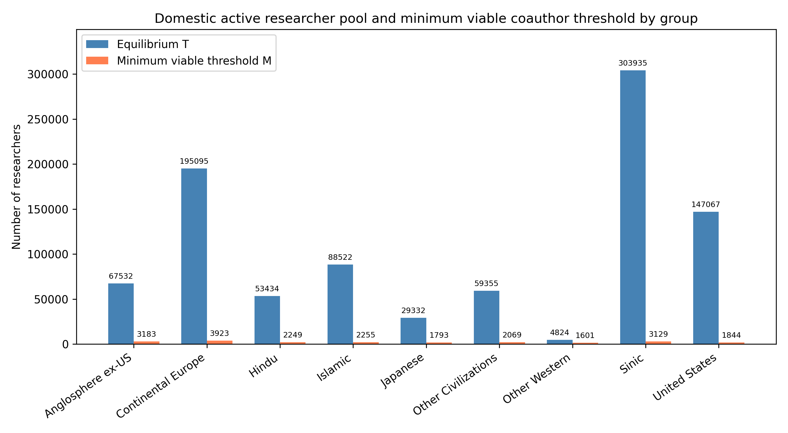
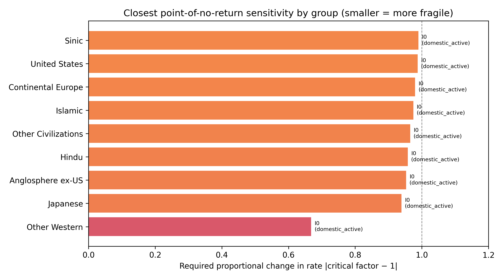

# Quantifying the Point of No Return in Global AI/ML Research Communities

**Article type:** Research Article / Research Note (to be confirmed)

## Abstract

International mobility can concentrate AI/ML researchers in a few regions, raising the risk that smaller research communities fall below a minimum viable coauthor pool and cannot recover. We model each civilisation as a six-compartment system of domestic and abroad early-career, high-impact, and principal-investigator researchers, and estimate transition rates from OpenAlex Artificial Intelligence works (subfield 1702). The minimum viable coauthor threshold is defined as M = k × c_bar, where c_bar is the mean number of authors per work and k is the median number of distinct last-author groups observed per recent year. Across 9 groups, equilibrium domestic active pools T remain above M, but the closest point of no return is observed for the Japanese group, where a proportional change of 0.58 in d (critical factor 1.58×) would drive the pool to its threshold. The largest positive leverage comes from PI-driven inflow and the conversion of high-impact researchers into PIs, while the dominant negative leverage is researcher dropout. These results provide a quantitative framework for early, safety-factor-bound interventions that preserve civilisational diversity in AI/ML research.

**Keywords:** researcher mobility; artificial intelligence; civilisation grouping; ordinary differential equations; point of no return; innovation studies

**Highlights**

- Nine civilisations modelled as six-compartment ODEs fitted to OpenAlex AI/ML data.
- Closest point of no return is Japanese PI pool; d needs only 0.58 proportional change.
- Dropout most negative; PI inflow and domestic promotion most positive.

## Data and Code Availability

This study uses publication metadata from the OpenAlex API (subfield 1702, Artificial Intelligence; 2000–2023). The extraction and analysis code, the country-to-civilisation mapping, and the result CSVs used to generate this manuscript are available in the public GitHub repository https://github.com/bougtoir/researcher-mobility-ode. OpenAlex data are released under CC0.

## Declarations

**Funding:** [To be completed / removed for double-blind review]

**Competing interests:** [To be completed / removed for double-blind review]

**Author contributions:** [To be completed / removed for double-blind review]

**Acknowledgments:** [To be completed / removed for double-blind review]

## 1. Introduction

Most debates on research mobility focus on net flows. Shifting attention to transition rates makes it possible to ask not only where researchers move, but which transitions must be altered to keep a community viable[1,2]. 
We operationalise this idea by modelling the stock of active researchers in each of nine modified Huntington civilisations as a coupled system of ordinary differential equations. 
The model is fitted to real publication records from OpenAlex and used to locate a point of no return: the parameter region in which the domestic active pool falls below the minimum number of coauthors needed to sustain the field.

## 2. Methods

### 2.1 Data and grouping

We extracted AI/ML works and author histories from the OpenAlex API for subfield `subfields/1702` (Artificial Intelligence), using works published between 2000 and 2023[3]. 
Authors were assigned to a Huntington-derived civilisation by majority country of affiliated institutions: United States, Anglosphere ex-US, Continental Europe, Sinic, Japanese, Hindu, Islamic, Other Western, and Other Civilisations. 
The rationale for splitting the Western bloc and merging smaller civilisations is documented separately.

### 2.2 Compartment model

Each group has six compartments: domestic early-career (D), abroad early-career (A), domestic hit researchers (H_D), abroad hit researchers (H_A), domestic PIs (P_D), and abroad PIs (P_A). 
Transitions are early-career outflow (alpha) and return (beta), hit generation (h_D, h_A), PI promotion (p_D, p_A), and dropout (d). 
New entrants follow endogenous PI-driven inflow I(P_D) = I0 + r·P_D, with r capped at half the stability-critical value (safety factor 0.5).

### 2.3 Minimum viable coauthor threshold

For each group we computed the mean number of authors per work (c_bar) and the median number of distinct last-author groups per recent year (k). 
The minimum viable domestic active pool is M = k × c_bar. When the equilibrium T = D + H_D + P_D falls below M, the community can no longer produce works at the observed coauthor intensity and is treated as past the point of no return.

### 2.4 Sensitivity and point-of-no-return scan

We computed elasticities by perturbing each transition rate by 1% and re-solving the equilibrium. 
For point-of-no-return analysis we scaled each rate in turn until T reached M, recording the critical factor and its proximity, defined as |critical factor − 1| (the proportional change in that rate required to reach the threshold).

## 3. Results

Table 1 reports equilibrium domestic active pool T, minimum viable threshold M, and endogenous inflow parameters for the 9 groups. 
All groups remain above their threshold under the fitted model, but margins differ by an order of magnitude.

**Table 1. Equilibrium domestic active pool, minimum viable threshold, and endogenous inflow parameters.**

| Group | T_eq | M | Margin | I0 | r | r_obs | r_crit |
|---|---|---|---|---|---|---|---|
| Anglosphere ex-US | 752.12 | 119.78 | 632.34 | 1.55 | 0.00239 | 0.11345 | 0.00478 |
| Continental Europe | 1156.27 | 129.07 | 1027.20 | 2.76 | 0.00261 | 0.12276 | 0.00523 |
| Hindu | 1497.37 | 66.04 | 1431.33 | 1.52 | 0.00106 | 0.11765 | 0.00213 |
| Islamic | 892.42 | 126.52 | 765.89 | 1.16 | 0.00141 | 0.13072 | 0.00282 |
| Japanese | 206.81 | 50.48 | 156.33 | 1.42 | 0.00993 | 0.13904 | 0.01985 |
| Other Civilizations | 424.70 | 104.60 | 320.10 | 1.15 | 0.00310 | 0.13072 | 0.00620 |
| Other Western | 513.12 | 57.17 | 455.95 | 0.87 | 0.00200 | 0.17647 | 0.00400 |
| Sinic | 1783.64 | 112.34 | 1671.29 | 2.38 | 0.00140 | 0.12059 | 0.00281 |
| United States | 801.70 | 132.49 | 669.21 | 2.83 | 0.00396 | 0.10504 | 0.00791 |

Table 2 shows the three transition-rate elasticities with the largest absolute impact on T for each group. 
Dropout (d) is the largest negative lever in every group; promotion of domestic hit researchers to PIs (p_D) and return from abroad (beta) are the main positive levers after inflow.

**Table 2. Top transition-rate elasticities for domestic active pool T.**

| Group | 1st rate | 1st elasticity | 2nd rate | 2nd elasticity | 3rd rate | 3rd elasticity |
|---|---|---|---|---|---|---|
| Anglosphere ex-US | d | -2.162 | p_D | 0.116 | beta | 0.046 |
| Continental Europe | d | -2.100 | p_D | 0.067 | beta | 0.047 |
| Hindu | d | -2.011 | p_D | 0.038 | h_D | 0.013 |
| Islamic | d | -2.051 | p_D | 0.057 | h_D | 0.022 |
| Japanese | d | -2.317 | p_D | 0.233 | h_D | 0.111 |
| Other Civilizations | d | -2.125 | p_D | 0.094 | h_D | 0.047 |
| Other Western | d | -2.123 | p_D | 0.137 | h_D | 0.014 |
| Sinic | d | -2.027 | p_D | 0.035 | h_D | 0.021 |
| United States | d | -2.126 | p_D | 0.087 | h_D | 0.066 |

Table 3 reports, for each group, the single rate that reaches the threshold with the smallest proportional change (closest point of no return). 
The Japanese group is the most fragile: a proportional change of 0.58 in d (critical factor 1.58×) would drive the domestic_PIs pool to its minimum viable threshold.

**Table 3. Closest point of no return by group.**

| Group | Target | Rate | Current | Critical factor | Proximity |
|---|---|---|---|---|---|
| Japanese | domestic_PIs | d | 0.0134 | 1.580 | 0.580 |
| Other Civilizations | domestic_PIs | I0 | 1.1486 | 0.282 | 0.718 |
| United States | domestic_PIs | I0 | 2.8304 | 0.185 | 0.815 |
| Anglosphere ex-US | domestic_PIs | I0 | 1.5548 | 0.184 | 0.816 |
| Islamic | domestic_PIs | I0 | 1.1638 | 0.153 | 0.847 |
| Other Western | domestic_PIs | I0 | 0.8723 | 0.131 | 0.869 |
| Continental Europe | domestic_PIs | I0 | 2.7634 | 0.122 | 0.878 |
| Sinic | domestic_PIs | I0 | 2.3837 | 0.066 | 0.934 |
| Hindu | domestic_PIs | I0 | 1.5156 | 0.046 | 0.954 |

**Figure 1. Equilibrium domestic active pool (T) and minimum viable coauthor threshold (M) by group.** All groups remain above the threshold, but the margin varies widely.

**Figure 2. Closest point-of-no-return proximity by group.** Smaller values indicate that a smaller proportional change in the listed transition rate is required to drive the group to its threshold.

### 3.1 Saturating recruitment extension

Replacing linear inflow with a saturating form I(P_D) = I0 + r·P_D / (1 + ε·P_D) lowers equilibrium pools for fast-growing groups because each additional PI adds fewer entrants. 
Table 4 compares the linear and saturating equilibrium T values.

**Table 4. Equilibrium T under linear and saturating PI-driven inflow.**

| Group | Linear T | Saturating T | ε |
|---|---|---|---|
| Anglosphere ex-US | 752.12 | 411.20 | 0.01429 |
| Continental Europe | 1156.27 | 632.67 | 0.00870 |
| Hindu | 1497.37 | 781.23 | 0.01538 |
| Islamic | 892.42 | 469.06 | 0.02222 |
| Japanese | 206.81 | 129.35 | 0.01818 |
| Other Civilizations | 424.70 | 234.34 | 0.02222 |
| Other Western | 513.12 | 270.32 | 0.04000 |
| Sinic | 1783.64 | 940.82 | 0.01000 |
| United States | 801.70 | 462.03 | 0.00714 |

## 4. Discussion

The model supports a transition-rate view of research-policy intervention. 
Because dropout has an elasticity near -2 for every group, policies that reduce attrition — stable junior positions, grants for risky early work, and family/visa support — have the highest marginal impact on community size. 
At the same time, PI-driven inflow and domestic PI promotion (p_D) have the largest positive elasticities, indicating that sustaining a senior core is necessary for generational renewal.

The Japanese group illustrates how a technologically advanced but demographically smaller civilisation can sit close to the PI point of no return even when the overall active pool looks comfortable. 
This asymmetry between T and P_D suggests that headline researcher counts can mask fragility in leadership generation.

From a global-diversity standpoint, the results argue for early intervention within a safety factor: small proportional adjustments to return rates, hit-generation, and dropout are sufficient to keep every group above its threshold, avoiding the concentration that would turn AI/ML into an oligopoly of a few large civilisations[1,2].

## 5. Limitations

OpenAlex affiliation and author country assignments are noisy, and the model treats each civilisation as a closed compartment with no cross-civilisation spillovers beyond endogenous inflow. 
Future extensions include network externalities, time-varying parameters, and a larger quantum-technology pilot to test transferability to security-relevant fields.

## References

1. Momentumyy. 人材流出ではなく『遷移係数』で考える研究コミュニティの存亡. note, 2024. https://note.com/momentumyy/n/n86df5d34282d (accessed 2024-08-09).
2. Huntington S P. The Clash of Civilizations and the Remaking of World Order. New York: Simon & Schuster, 1996.
3. Priem J, Piwowar H, Orr R. OpenAlex: A fully-open index of scholarly works, authors, venues, institutions, and concepts. arXiv:2205.01813, 2022.
